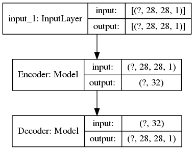
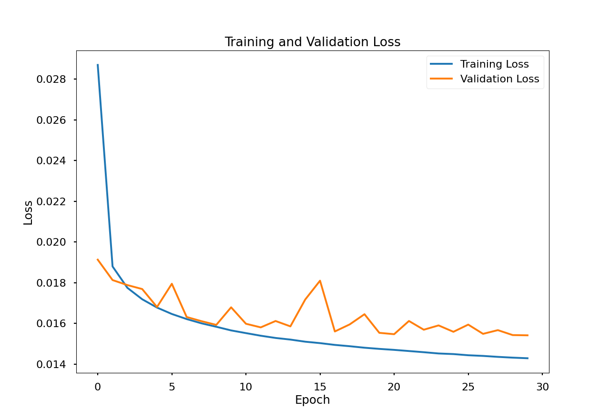
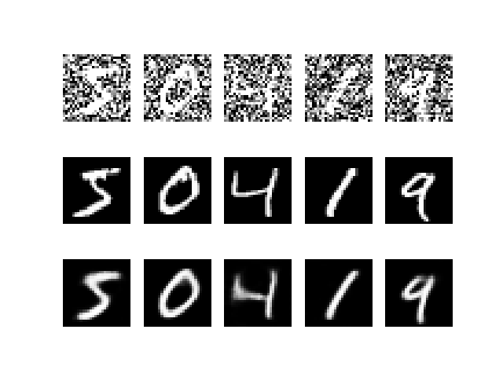
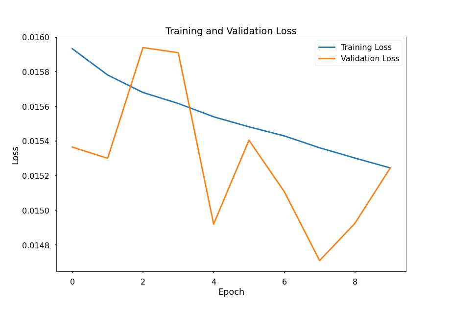
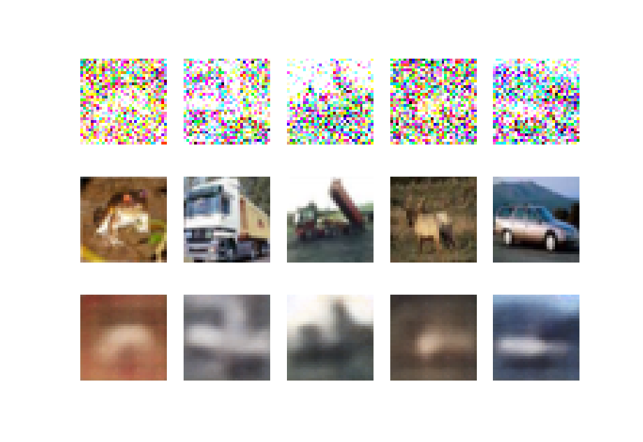

# Denoising AutoEncoder

Denoising AutoEncoders are a stochastic version of standard AutoEncoders that reduces the risk of learning the identity function.

Denoising AutoEncoders attempt to get around this risk of identity-function affiliation by introducing noise, i.e. randomly corrupting input so that the AutoEncoder must then "DeNoise" or reconstruct the original input.

## MNIST
### Model

### Training
Model is trained with a Batch Size of 32 for 100 Epochs with Filters = (32,64) and LatentDims = 16.

### Results
1st Row contains Images passed to Model as Input, 2nd Row Images are Targets for corresponding Inputs and 3rd Row contains Images that are Predicted by the Model.\

## CIFAR10
### Model

### Training
Model is trained with Filters = (16,32,64) and LatentDims = 32 as follows:
1. Batch Size = 32, Epochs = 100
2. Batch Size = 16, Epochs = 50
3. Batch Size = 8, Epochs = 25
4. Batch Size = 4, Epochs = 10

Training Loss Plot of last 10 Epochs is\

### Results
1st Row Images are Inputs, 2nd Row Images are Targets and 3rd Row Images are Predictions by the Model.\

