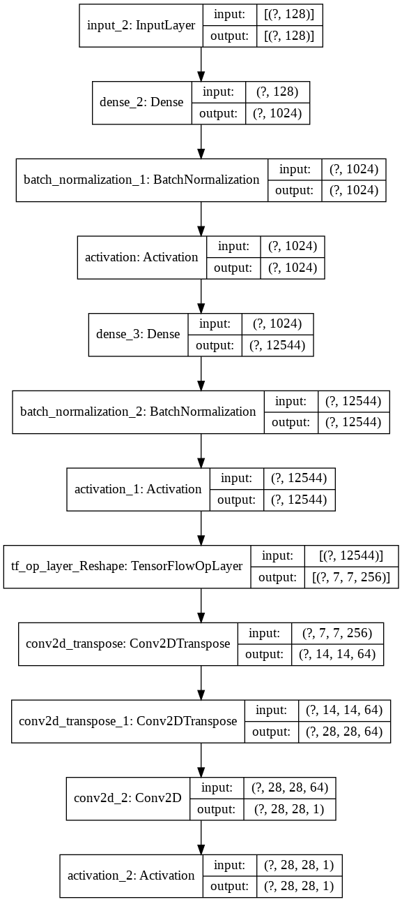
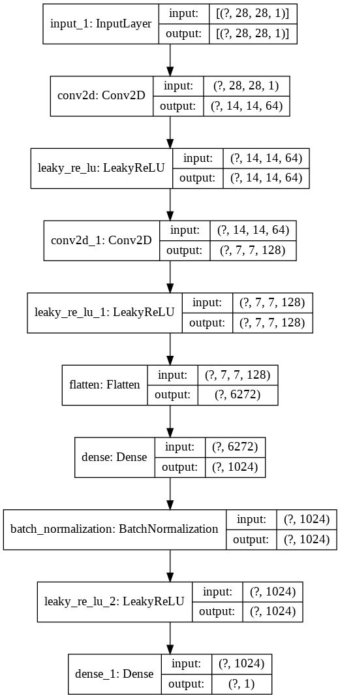

# TF-GAN for Handwritten Digits

Generative Adversarial Network (GAN) is Built and Trained to Generate Handwritten Digits.

Dataset: MNIST Dataset

The following architectures of Generator and Discriminator are standard ones for generation of Handwritten Digits Task.

## Generator Architecture

Generator tries to Create Fake Data from Random Inputs(Incase of some GANs).

## Discriminator Architecture

Discriminator tries to Detect between Fake Data and Real Data.
