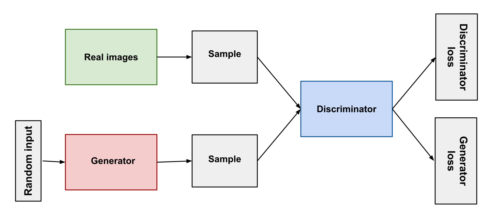

# Generative-Adversarial-Networks
Building and Training GANs.

## TF-GAN for Handwritten Digits
Generative Adversarial Network (GAN) is Built and Trained to Generate Handwritten Digits.

## DeNoising AutoEncoder
Denoising AutoEncoder is a stochastic version of standard AutoEncoders that reduces the risk of learning the identity function.
